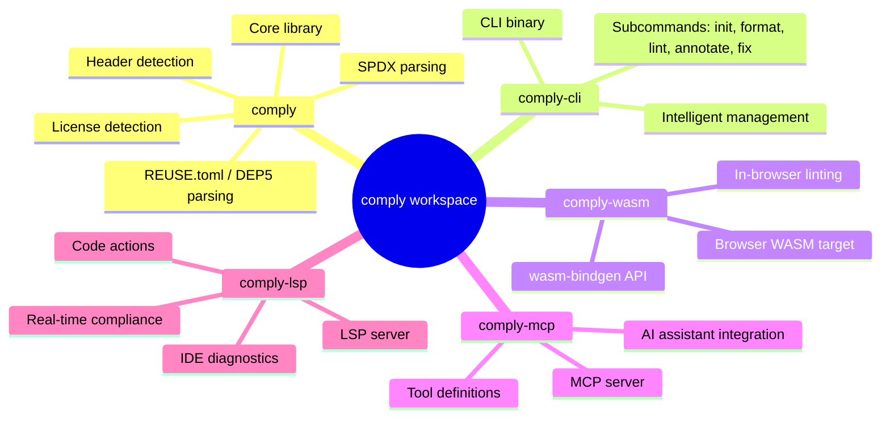
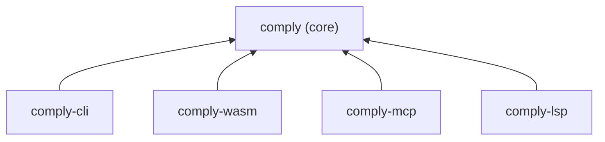
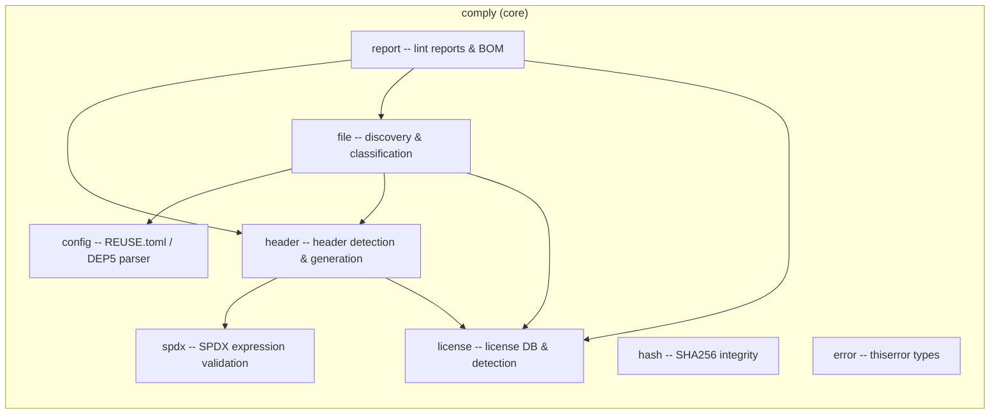
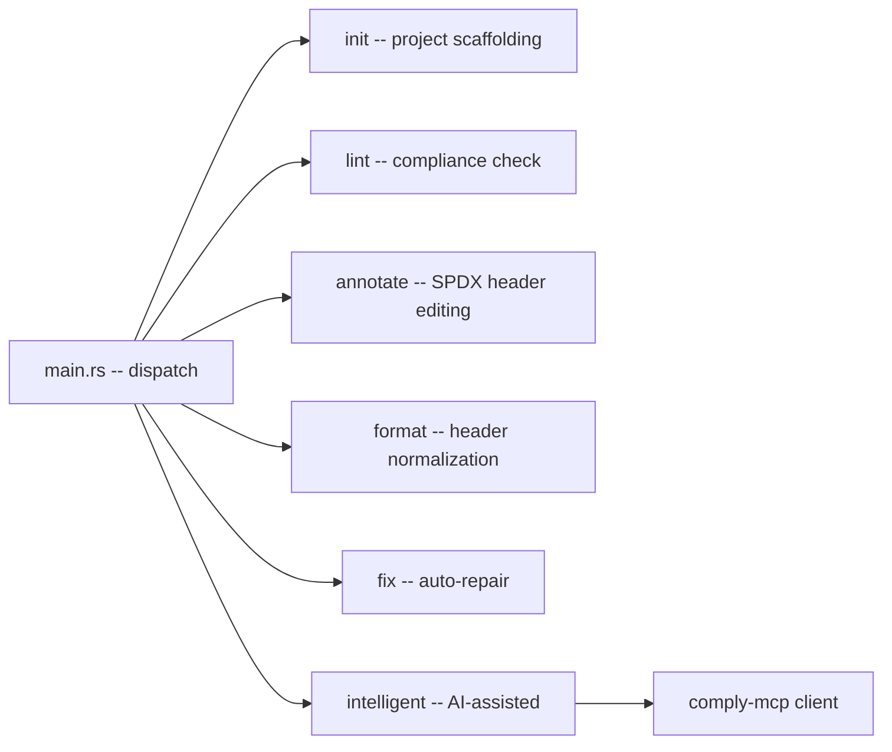
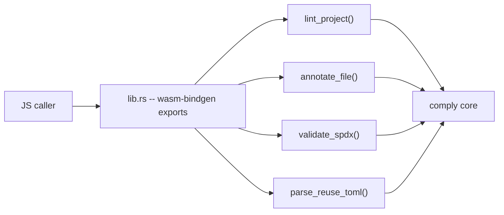
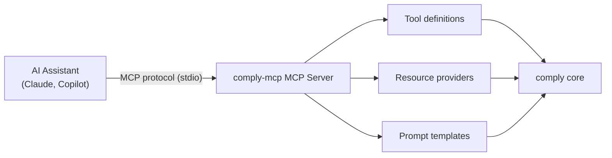
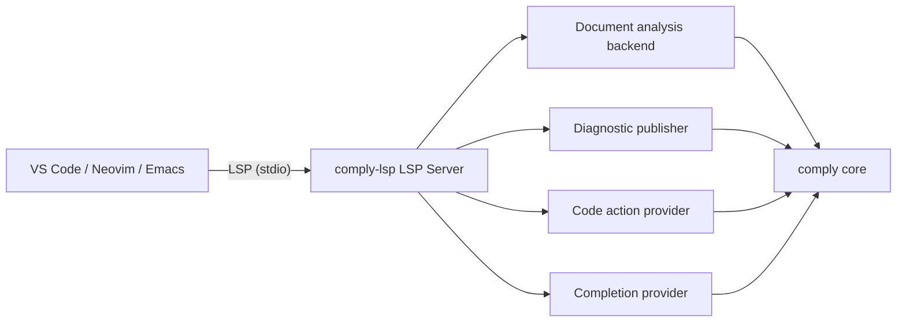

<!--
SPDX-FileCopyrightText: COMPLY contributors

SPDX-License-Identifier: MIT OR Apache-2.0
-->

# comply Architecture

## Overview

comply is a **REUSE compliance tool** written in pure Rust. It checks and
enforces the [REUSE Specification](https://reuse.software/spec/) for
declaring licenses in software projects.

Unlike the Python [fsfe/reuse-tool](https://github.com/fsfe/reuse-tool),
comply is a native Rust implementation -- no runtime dependency on Python,
faster execution, and compilable to WASM for browser use.

## Guiding principles

- **TDD**: Test first, implement, refactor.
- **Security-first**: `thiserror` in libraries, `anyhow` in binaries, no
  unwrap/expect on external input.
- **No unsafe code**: The `unsafe_code = "deny"` lint is set workspace-wide.
  Zero `unsafe` blocks, functions, or traits are permitted.
- **REUSE-compatible**: Configuration and output are interchangeable with the
  Python reuse-tool.
- **KISS, DRY, YAGNI, TDA, SOLID**.
- **Stable Rust**: Edition 2024, pinned via `rust-toolchain.toml`.

---

## Workspace structure

The root `Cargo.toml` is a virtual workspace. Five crates live under
`crates/`:



---

## Crate dependency graph



`comply` is the sole leaf crate (excluding standard dependencies) -- every
surface crate depends on it and nothing else.

---

## Core library design



All modules depend on `error` for typed errors.

---

## Surface crate designs

### comply-cli



### comply-wasm



### comply-mcp



### comply-lsp



---

## External dependencies

| Dependency         | Used by                                  | Purpose                           |
| ------------------ | ---------------------------------------- | --------------------------------- |
| `serde` 1          | `comply`                                 | REUSE.toml / DEP5 deserialization |
| `serde_json` 1     | `comply`                                 | JSON report output                |
| `toml` 0.8         | `comply`                                 | REUSE.toml parsing                |
| `thiserror` 2      | `comply`                                 | Typed error enums                 |
| `sha2` 0.10        | `comply`                                 | SHA256 hashing                    |
| `walkdir` 2        | `comply`                                 | Recursive file discovery          |
| `ignore` 0.4       | `comply`                                 | Gitignore-aware file filtering    |
| `regex` 1          | `comply`                                 | SPDX header regex scanning        |
| `clap` 4           | `comply-cli`                             | CLI argument parsing              |
| `wasm-bindgen` 0.2 | `comply-wasm`                            | JS/WASM bridge                    |
| `mcp-sdk` 0.x      | `comply-mcp`                             | MCP protocol implementation       |
| `tower-lsp` 0.x    | `comply-lsp`                             | LSP framework                     |
| `tokio` 1          | `comply-cli`, `comply-mcp`, `comply-lsp` | Async runtime                     |

---

## External API

### CLI (comply-cli)

```text
Usage: comply <COMMAND>

Commands:
  init       Initialize a project for REUSE compliance
  format     Format SPDX headers consistently
  lint       Check project for REUSE compliance
  annotate   Add or update SPDX headers
  fix        Auto-fix compliance issues
  help       Print this message or the help for the given subcommand(s)

Options:
  -h, --help     Print help
  -V, --version  Print version
```

### WASM (comply-wasm)

```rust
// wasm-bindgen exports
pub fn lint_project(files: JsValue) -> JsValue;        // FileEntry[] -> LintReport
pub fn annotate_file(source: &str, license: &str,      // source content -> annotated content
    copyright: &str) -> String;
pub fn validate_spdx(expression: &str) -> JsValue;     // expression -> ValidationResult
pub fn parse_reuse_toml(content: &str) -> JsValue;     // TOML content -> ReuseConfig
```

### MCP (comply-mcp)

Tools exposed via MCP:

- `lint_project` -- run compliance check on a project directory
- `annotate_file` -- annotate a file with SPDX header
- `init_project` -- create REUSE project structure
- `check_spdx` -- validate SPDX expression
- `list_licenses` -- list all known SPDX licenses

### LSP (comply-lsp)

Capabilities advertised to editor:

- `TextDocumentSyncKind::Incremental`
- `Diagnostics` -- compliance issues as diagnostics
- `CodeAction` -- fix compliance issues
- `CompletionItem` -- SPDX license ID completion
- `HoverProvider` -- license details on hover

---

## Key design decisions

| Decision                  | Rationale                                 |
| ------------------------- | ----------------------------------------- |
| REUSE spec compatible     | Drop-in replacement for Python reuse-tool |
| Native Rust               | No Python dependency, faster, WASM target |
| Multi-surface             | One core powers CLI + WASM + LSP + MCP    |
| Unsafe code forbidden     | `unsafe_code = "deny"` workspace-wide     |
| Stable Rust               | Edition 2024, pinned toolchain            |
| Bundled SPDX License List | Works offline, no network dependency      |
| TDD strictly              | Every feature starts with a failing test  |

---

## Configuration

All shared metadata lives in the root `Cargo.toml`:

- `[workspace.package]` -- edition, license, version
- `[workspace.lints.rust]` -- lint policy (warnings-as-errors)
- `[workspace.dependencies]` -- shared external and internal dependencies

Build profiles and target-specific linker flags are in `.cargo/config.toml`.
Rust toolchain is pinned via `rust-toolchain.toml` (stable).

---

## Testing strategy

- **Unit tests**: Inline `#[cfg(test)] mod tests` in every module.
- **Integration tests**: Full `comply lint` on fixture projects in `tests/`.
- **Fixtures**: `tests/fixtures/` with known compliance states (compliant,
  missing headers, invalid SPDX, mixed license).
- **Round-trip tests**: Serialize -> deserialize -> compare for REUSE.toml.
- **Compat tests**: Compare output with Python `reuse` tool on same fixtures.
