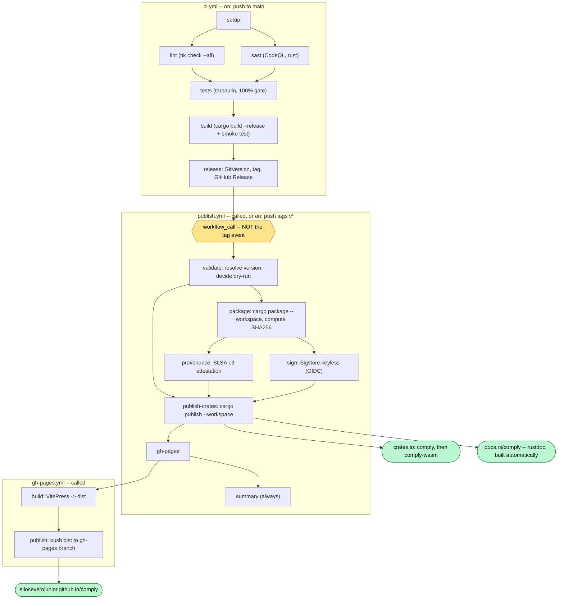

<!--
SPDX-FileCopyrightText: COMPLY contributors

SPDX-License-Identifier: MIT OR Apache-2.0
-->

# comply -- REUSE Compliance Tool Runbook

This guide provides comprehensive execution instructions for the `comply` REUSE compliance tool.

## Overview

The [REUSE Specification](https://reuse.software/spec/) defines a standard for declaring copyright and licensing information in software projects. `comply` is a native Rust implementation that checks and enforces compliance.

## Installation

```bash
# From source (workspace)
cargo build --release -p comply
./target/release/comply --help

# Or install via cargo
cargo install --git https://github.com/elioseverojunior/comply --locked comply
```

## Quick Start

### Check a project for compliance

```bash
# From the comply workspace
cargo run -p comply -- lint /path/to/your/project

# Or if installed via cargo
comply lint /path/to/your/project

# Defaults to current directory if no path provided
comply lint
```

### Initialize a project

```bash
comply init /path/to/your/project

# With force overwrite and custom config name
comply init --force --config-name reuse.toml /path/to/your/project

# Defaults to current directory
comply init
```

This creates:

- `REUSE.toml` (or specified config name) -- compliance manifest
- `LICENSE` -- dual-license notice (MIT OR Apache-2.0)
- `LICENSE-MIT` -- MIT license text
- `LICENSE-APACHE` -- Apache-2.0 license text

### Annotate a file

```bash
comply annotate --license MIT --copyright "2026 Acme Inc" src/main.rs

# With multiple holders
comply annotate --holder "Elio <elioseverojunior@gmail.com>" \
                --holder "Elio <elio@elio.eti.br>" \
                --license "MIT OR Apache-2.0" \
                --recursive .

# Override specific file, update REUSE.toml
comply annotate --license MIT --force --precedence override DCO.txt
```

## Subcommands

### `init`

Initialize REUSE structure in a project:

```text
comply init [path] [--force] [--config-name <name>]

Arguments:
  path               Project directory (default: current directory)

Flags:
  --force            Overwrite existing REUSE.toml and license files
  --config-name      Config filename: REUSE.toml (default), reuse.toml, .reuse.toml
```

Creates:

- `<config-name>` -- compliance manifest with default annotations
- `LICENSE` -- dual-license notice (MIT OR Apache-2.0)
- `LICENSE-MIT` -- MIT license text
- `LICENSE-APACHE` -- Apache-2.0 license text

### `lint`

Check project compliance:

```text
comply lint [path] [--json] [--spdx]

Arguments:
  path               Project directory (default: current directory)

Flags:
  --json        Output as JSON
  --spdx        Output SPDX Bill of Materials

Exit codes:
  0  -- project is REUSE compliant
  1  -- project has compliance issues
```

### `annotate`

Add or update SPDX headers:

```text
comply annotate [files...] --license <id> [--copyright <text>] [flags]

Arguments:
  files...           Files to annotate (default: all source files under path)

Required (unless provided by REUSE.toml):
  --license <id>         SPDX license identifier (e.g., "MIT", "MIT OR Apache-2.0")
  --copyright <text>     Copyright notice (or use --holder)

Optional:
  --year <year>          Copyright year (supports ranges: "2017-2019", "2017, 2019-2024")
  --holder <name>        Copyright holder "Name <email>" (repeatable, builds copyright string)
  --contributor <name>   Contributor name for SPDX-FileContributor (repeatable)
  --path <dir>           Project root directory (default: current directory)
  --recursive, -r        Recurse into directories
  --exclude-year         Exclude year from copyright notice
  --merge-copyrights     Merge identical copyrights
  --copyright-prefix <style>  spdx (default), spdx-c, spdx-symbol, string, symbol
  --force-dot-license    Force .license companion file instead of inline header
  --force                Overwrite existing headers
  --update-reuse-toml    Also append override annotation to REUSE.toml (default: true)
  --no-update-reuse-toml Disable REUSE.toml update
  --precedence <type>    For --update-reuse-toml: closest, aggregate, override (default: override)
  --skip-unrecognised    Skip files with unrecognised comment styles
```

**Note:** When `--license`/`--copyright` omitted, values are read from matching `[[annotations]]` in REUSE.toml.

### `format`

Format SPDX headers consistently:

```text
comply format [path] [--check]

Arguments:
  path               Project directory (default: current directory)

Flags:
  --check       Check if files are formatted without making changes
```

Normalizes:

- Header ordering (copyright before license)
- Line endings
- Comment style consistency
- Whitespace

### `fix`

Automatically fix common compliance issues:

```text
comply fix [path] [--dry-run] [--verbose]

Arguments:
  path               Project directory (default: current directory)

Flags:
  --dry-run     Show what would be fixed without making changes
  --verbose     Detailed output of each fix

Fixes:
  - Missing SPDX headers
  - Invalid SPDX expressions
  - Missing license files in LICENSES/
  - Incorrect DEP5 coverage
  - Missing .license companion files for binary files
```

## Configuration

### REUSE.toml (preferred)

```toml
version = 1
SPDX-PackageName = "my-project"
SPDX-PackageSupplier = "Contributors"
SPDX-PackageDownloadLocation = "https://github.com/user/my-project"

# Optional: extend default source file classification
source-patterns = ["src/**", "scripts/**", "*.py", "*.rs", "Makefile*"]

[[annotations]]
SPDX-FileCopyrightText = "2026 Project Contributors"
SPDX-License-Identifier = "MIT OR Apache-2.0"
path = ["**"]
precedence = "aggregate"

[[annotations]]
SPDX-License-Identifier = "MIT"
path = ["LICENSES/MIT.txt"]
precedence = "aggregate"

[[annotations]]
SPDX-License-Identifier = "Apache-2.0"
path = ["LICENSES/Apache-2.0.txt"]
precedence = "aggregate"
```

### `source-patterns`

Extends the default source file classification (which only includes actual programming languages). Add patterns for config files, docs, etc. that should be treated as source.

### `[[annotations]]` precedence

| Value               | Behavior                                        |
| ------------------- | ----------------------------------------------- |
| `closest` (default) | File's own header wins; REUSE.toml is fallback  |
| `aggregate`         | Both file header AND REUSE.toml apply           |
| `override`          | REUSE.toml annotation wins; ignores file header |

### .reuse/dep5 (legacy)

```text
Format: https://www.debian.org/doc/packaging-manuals/copyright-format/1.0/
Upstream-Name: my-project
Upstream-Contact: Contributors

Files: src/*
Copyright: 2026 Project Contributors
License: MIT OR Apache-2.0
```

**Note:** REUSE.toml and .reuse/dep5 are mutually exclusive. If REUSE.toml exists, .reuse/dep5 is ignored.

## File Types and Handling

### Source files (get inline headers)

Programming languages: `.rs`, `.c`, `.cpp`, `.h`, `.java`, `.py`, `.js`, `.ts`, `.go`, `.rb`, `.sh`, `.swift`, `.kt`, `.scala`, `.zig`, `.dart`, `.cs`, `.fs`, `.erl`, `.ex`, `.hs`, `.lua`, `.pl`, `.lisp`, `.clj`, `.pas`, `.r`, `.ml`, `.v`, `.sv`, `.vhd`, plus special names: `Makefile`, `Dockerfile`, `Gemfile`, `Rakefile`, `Cargo.lock`, `build.gradle`, `pom.xml`

```rust
// SPDX-FileCopyrightText: 2026 Acme Inc
// SPDX-License-Identifier: MIT OR Apache-2.0
```

### Binary files (get .license companion)

Images, archives, compiled artifacts, fonts, PDFs

```text
binary.bin
binary.bin.license   <-- SPDX header in this file
```

### Ignored files

Config (`.toml`, `.yaml`, `.json`, `.ini`, `.cfg`, `.conf`, `.lock`, `.editorconfig`, `.gitignore`, `.dockerignore`), docs (`.md`, `.rst`, `.txt`, `.html`, `.xml`, `.css`, `.scss`), licenses (`LICENSE*`), and data files are classified as `Ignored` by default and skipped by `annotate --recursive`.

Use `source-patterns` in REUSE.toml to include specific patterns as source.

### REUSE-Ignore blocks

```text
# SPDX-FileCopyrightText: 2026 Acme Inc
# SPDX-License-Identifier: MIT

# REUSE-IgnoreStart
echo "SPDX-FileCopyrightText: $(date +'%Y') John Doe" > file.txt
echo "SPDX-License-Identifier: MIT" > file.txt
# REUSE-IgnoreEnd
```

Headers between `REUSE-IgnoreStart` and `REUSE-IgnoreEnd` are ignored by lint.

## Expected Output

### Compliant project

```text
$ comply lint my-project
# PASS: my-project is REUSE compliant

Files: 23
  Compliant: 23 (100%)
```

### Non-compliant project

```text
$ comply lint my-project
# FAIL: my-project has REUSE compliance issues

Files: 25
  Compliant: 20 (80%)
  Missing copyright: 3
  Missing license: 2
  Invalid SPDX: 1

Summary:
  src/lib.rs -- Missing SPDX header
  src/utils.rs -- Missing SPDX-FileCopyrightText
  data/config.json -- Missing .license file
  LICENSES/ -- Missing license texts: MIT
```

## Troubleshooting

### Common Issues

1. **"No license information found"**
   - Run `comply init` first to create the REUSE structure
   - Add license files to `LICENSES/`
   - Annotate files with `comply annotate`

2. **"Invalid SPDX expression"**
   - Run `comply lint --json` for detailed error
   - Common mistakes: `OR` vs `AND`, missing parentheses
   - Use valid SPDX identifiers from <https://spdx.org/licenses/>

3. **"DEP5/REUSE.toml parsing error"**
   - Check the file format (REUSE.toml is TOML, dep5 is DEP5 format)
   - Valid only in `.reuse/` directory or root as `REUSE.toml`
   - One file can't have both formats

4. **"Missing license file"**
   - Add the license text to `LICENSES/` directory
   - Use standard SPDX license texts from <https://spdx.org/licenses/>
   - File must match `SPDX-License-Identifier` exactly

5. **Files skipped during annotate --recursive**
   - Config/docs/data files are `Ignored` by default
   - Add `source-patterns = ["config/**", "*.md"]` to REUSE.toml to include them

## Release

Publishing is `ci.yml` calling `publish.yml`, which calls
`gh-pages.yml`. Nothing reaches crates.io unless `provenance` and `sign`
both succeed first.



Three things in that graph are load-bearing and each cost a red run to find.

**`workflow_call`, not the tag event.** `ci.yml` pushes the tag with
`GITHUB_TOKEN`, and GitHub raises no workflow-triggering event for that token --
so `publish.yml`'s `push: tags` never fired and nothing downstream of a release
had ever run. Calling it directly expresses the dependency structurally, with no
long-lived PAT. The tag trigger remains for a tag a human pushes.

**`publish-crates` needs BOTH `provenance` and `sign`.** `needs:` cannot reach
across workflow files, so while publishing lived in `crates-publish.yml` and
signing in `release.yml`, nothing sequenced them: a crate could reach crates.io
before -- or without -- its attestation. Merging them is what makes that
orderable.

**Two documentation channels, not one.** The user-facing VitePress site is
published by `gh-pages.yml` to the `gh-pages` branch, which is what
Pages serves. The developer-facing API reference is docs.rs's, built
automatically from the published crate. A `publish-docs` job used to deploy
rustdoc through the Pages _artifact_ path as well -- a repo serves from one
source, so it published nothing and was removed.

### Steps

1. **Version** -- `ci.yml`'s release job runs GitVersion on a push to the default
   branch, then tags and creates the GitHub Release, then calls `publish.yml`.
   `bump-version.yml` did this by hand and no longer exists.
2. **Tag** -- to release independently of a push to main:

   ```sh
   mise run git:tag:create          # v<SemVer>, plus the floating v<major>[.<minor>] tags
   git push --tags                  # yours to run; the tooling never pushes
   ```

3. **Verify the artifacts** -- `publish.yml` packages both crates, attaches SLSA
   L3 provenance, and signs with Sigstore. Publishing waits on both. Note
   `upload-assets` is gated on a tag ref: off a tag there is no Release to
   attach to, and the SLSA generator fails rather than skipping.
4. **Confirm** -- `publish-crates` runs `cargo publish --workspace`, which
   resolves the order from the dependency graph: `comply` first, then
   `comply-wasm`. Authentication is short-lived OIDC via
   `crates-io-auth-action`, which mints one token scoped to every crate in this
   repository that carries its own Trusted Publishing config -- a crate without
   one is rejected even though the others succeed.

### Dry run

`publish.yml` also accepts `workflow_dispatch` with `dry_run: true`, and
`ci.yml` currently passes it on every call,
which verifies the packages and stops before publishing. Locally the same check
is:

```sh
cargo package --workspace
```

### Version source of truth

`version` lives once, in `[workspace.package]` of the root `Cargo.toml`; both
crates inherit it with `version.workspace = true`. `cargo set-version` edits
that single field, so the two crates cannot drift apart.

## Integration

### CI/CD (GitHub Actions)

```yaml
- name: Check REUSE compliance
  run: comply lint .
```

### Pre-commit Hook

```yaml
# .pre-commit-config.yaml
repos:
  - repo: local
    hooks:
      - id: comply-lint
        name: REUSE compliance check
        entry: comply lint
        language: system
        pass_filenames: false
```

### Editor Integration

- **VS Code**: Install comply-lsp extension for real-time compliance feedback
- **Neovim**: Configure comply-lsp as a language server
- **Emacs**: Use eglot or lsp-mode with comply-lsp

## Next Steps

Once you've achieved compliance:

1. **Add to CI** -- ensure `comply lint` runs on every PR
2. **Create REUSE.toml** -- move from per-file headers to aggregate annotations
3. **Add custom licenses** -- use `LicenseRef-*` identifiers for non-standard licenses
4. **Machine-readable output** -- use `--json` or `--spdx` for tooling integration
5. **Distribute** -- ensure `LICENSES/` directory is included in distributions
6. **Supply chain** -- provide SPDX SBOM via `comply lint --spdx`

## Reference

- REUSE Specification: <https://reuse.software/spec/>
- SPDX License List: <https://spdx.org/licenses/>
- SPDX Specification: <https://spdx.github.io/spdx-spec/>
- comply source: <https://github.com/elioseverojunior/comply>
